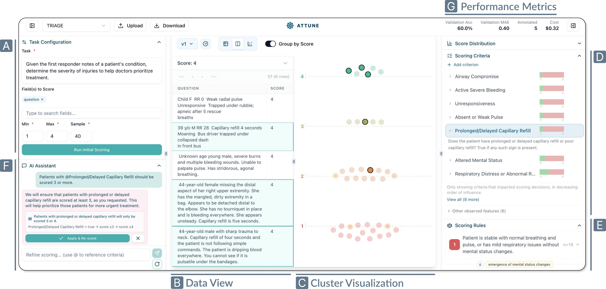

# Attune: Interactive Steering of LLM-powered Scoring

Attune is a mixed-initiative system for scoring text records at scale with LLMs. Instead of scoring records in isolation with a prompt, Attune compares records pairwise to build a holistic understanding of the data, resolves those comparisons into consistent scores, and derives the scoring criteria and rules bottom-up — then lets you inspect and *deterministically* refine that scoring logic through direct manipulation and natural-language feedback.

**Live deployment:** [attune-alpha.vercel.app](https://attune-alpha.vercel.app)



## Getting started

**Prerequisites:** Python ≥ 3.12, Node.js ≥ 20.9.

### 1. Backend

```bash
cd backend
python3 -m venv venv
source venv/bin/activate
pip install -r requirements.txt
uvicorn app:app --reload --port 8000
```

### 2. Frontend

```bash
cd frontend
npm install
npm run dev
```

Open [http://localhost:3000](http://localhost:3000)

### 3. Add your API keys

In the frontend, open **Edit › Edit API Keys**, set a [LiteLLM model string](https://docs.litellm.ai/docs/providers) (e.g. `openai/gpt-4.1`, `azure/<deployment>`, `anthropic/claude-sonnet-4-5`), and paste the matching provider key (OpenAI, Anthropic, Azure, Gemini, OpenRouter, or any custom variable LiteLLM understands). Keys are not stored and need to be re-entered for every browser session.

If you are running locally and wish to avoid re-entering your key, you can set them in `backend/.env` (see [`backend/.env.example`](backend/.env.example)).

### 4. Score Records

To get started, pick a sample dataset from the dropdown or **Upload** your own dataset. Use the Task Configuration pane to describe the scoring task, choose the field(s) to score, mention the score range, and hit **Run Initial Scoring**. 

**Uploading Data:** Upload a JSON array of flat records.


## License

[MIT](LICENSE)
